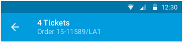

The Android app uses the [material design app bar](https://www.google.com/design/spec/layout/structure.html#structure-app-bar) throughout the application. Styling and positioning information should be consistent with Google's specifications. For the system bar above it, it is a translucent style (black at 24% opacity).

###Standard

Usage:

* Top level sections (such as Discover, My Tickets, Favorites, Venues, Messages)

###Back

Usage:

* Child Views

###Two Lines

Usage:

* EDP
* Pages that are event specific that require reaffirming the event info to the user

###Search

Usage:

* Any search context

###Contextual

Usage:

* Selection of text
* Can be used for being in an Editting mode