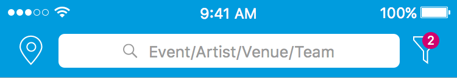
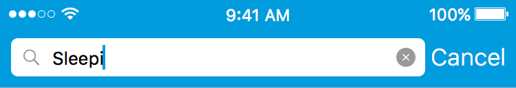
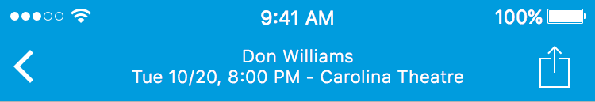
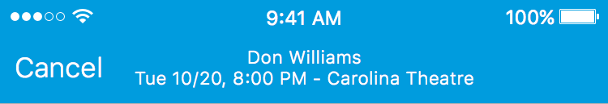
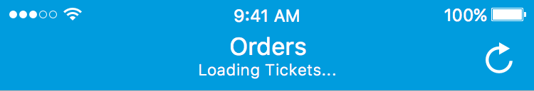
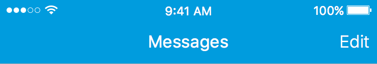

###Search

* Displayed on the Discover view

* Used to search for events

###Search Active

* Displayed on the Discover view

* Used to search for events

###Event Detail

* Displayed on the Event Detail view

* Displays event title, event date, event time and event location

###Purchase Modal

* Displayed when tapping "Find Tickets" from the event detail view

###Orders

* Displayed when tapping the "My Tickets" tab

###Messages

* Displayed when tapping the "Messages" tab

* Allows user to enter an edit mode where they can select all messages

